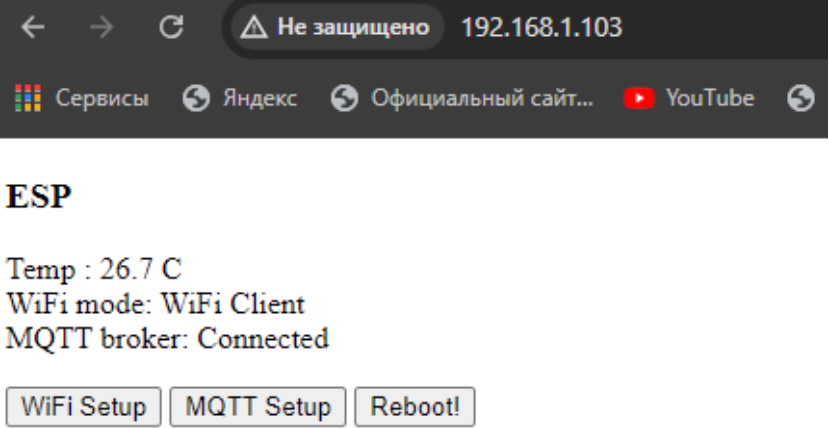
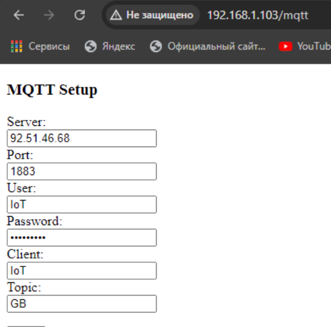
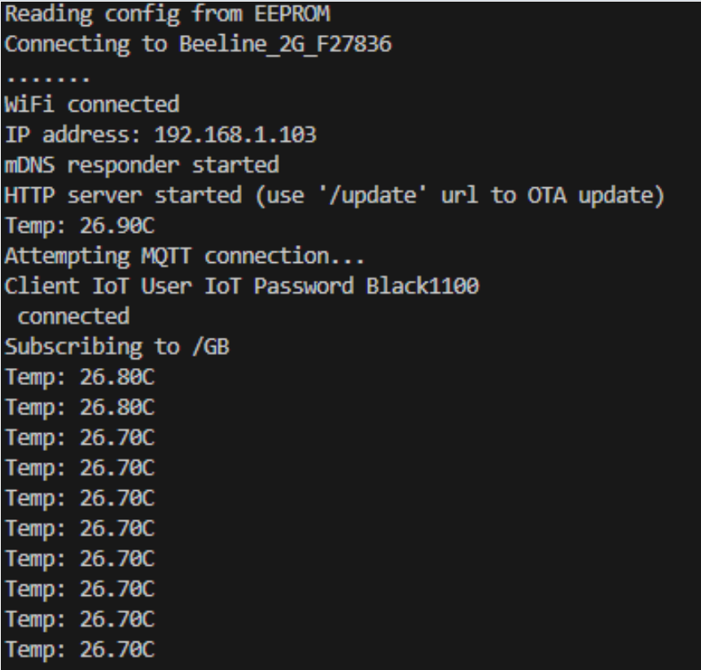
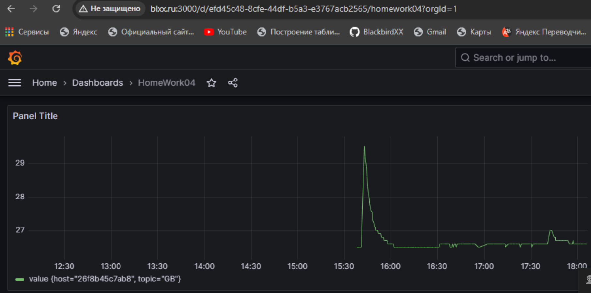
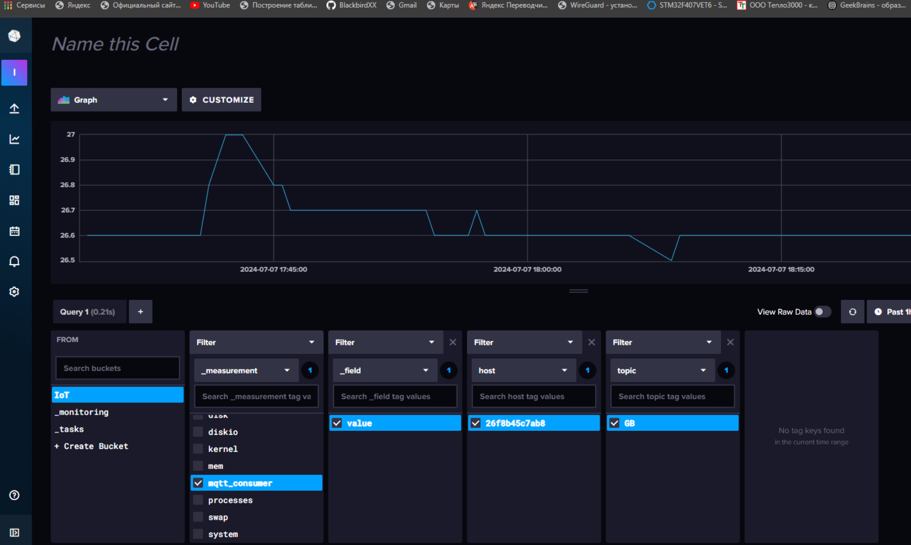

## Описание устройства и принцип работы

Устройство для передачи данных собрано на базе ESP8266 и датчика температуры DHT22. Имеет Web интерфейс для просмотра текущих показаний, статусов и настроек, а так же возможность внесения новых значений для подключения к сети WiFi, или MQTT брокеру.

При первом запуске, устройство создает точку доступа WiFi с iP адресом 192.168.4.1 Настройки подключения по MQTT отсутствуют. Необходимо зайти на веб страницу устройства и ввести данные в соответствующие поля для подключения к сети WiFi, и MQTT.

При нажатии кнопки "Save" новые значения запишутся в EEPROM. При перезапуске устройства, если введены корректные данные, то оно будет подключаться к сети WiFi, а также к MQTT брокеру.

Отправка данных с температурой происходит раз в 30 секунд.

Серверная часть проекта для приема данных это - удаленный сервер с белым iP на базе Linux Ubuntu 22.04.3 LTS. На котором развернуто несколько Docker контейнеров.

Условная схема передачи данных :

Показания температуры -> отправка по MQTT -> брокер Mosquitto -> Telegaf -> InfluxDB -> Grafana

Проект сделан в среде разработки VSCode c плагином PlatformIO.
Использован фрэймворк Arduino и библиотеки подходящие к нему.

## Отображение WEB интерфейса устройства

### Главная страница
* Показания текущей температуры
* Тип подключения WiFi (Точка доступа или подключение к роутеру)
* Статус подключения к MQTT серверу

* Настройки для подключения к WiFi сети

* Настройки подключения по MQTT

### Лог работы устройства в мониторе порта

### Работа на сервере (Grafana)

### Работа на сервере (InfluxDB)

